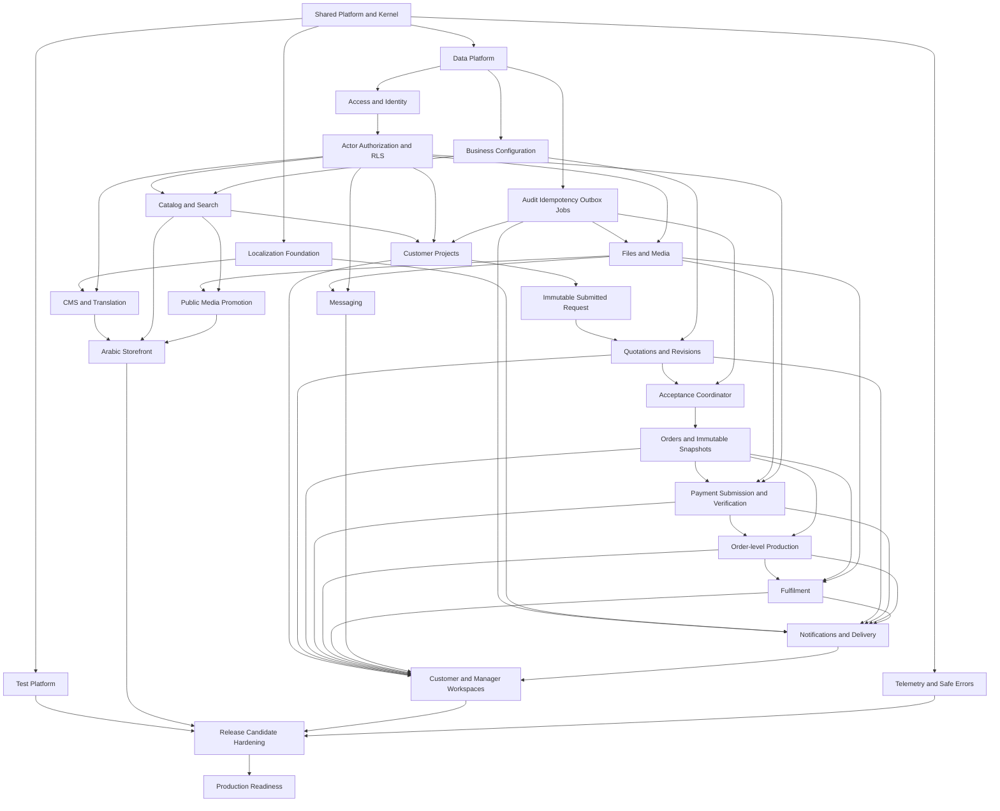
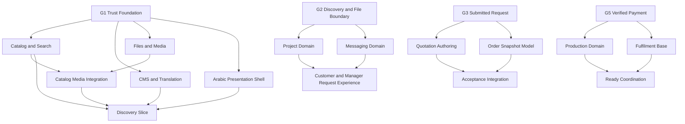
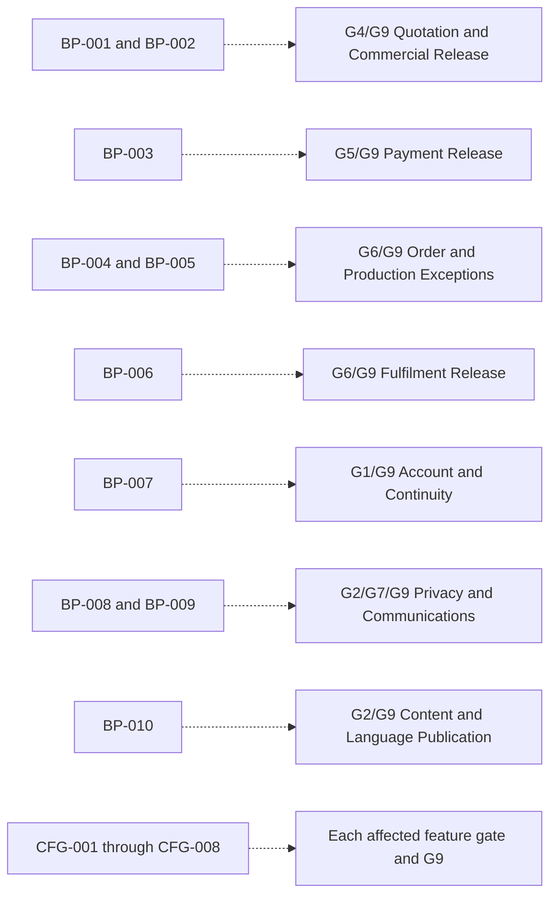

# Version 1 Implementation Dependency Graph

**Status:** Approved by the Product Owner on 2026-07-16  
**Scope:** Phase, module, invariant, policy, and parallel-delivery dependencies

## 1. Reading the graph

- A solid arrow means the destination cannot complete before the source passes.
- Parallel branches may start together only after their shared predecessor contract is stable.
- A gate is evidence, not elapsed time.
- Policy/configuration gates constrain affected behavior or release; they do not authorize guessed values.

## 2. Phase graph

```mermaid
flowchart LR
    P0[P0 Delivery Foundation] --> G0{G0 Foundation Green}
    G0 --> P1[P1 Trusted Data and Access]
    P1 --> G1{G1 Trust Boundary Proven}
    G1 --> P2[P2 Discovery and Files]
    P2 --> G2{G2 Discovery and File Boundary}
    G2 --> P3[P3 Projects and Clarification]
    P3 --> G3{G3 Request Submitted}
    G3 --> P4[P4 Quotations Acceptance Orders]
    P4 --> G4{G4 Commercial Boundary}
    G4 --> P5[P5 Payment Verification]
    P5 --> G5{G5 Payment Gate}
    G5 --> P6[P6 Production and Fulfilment]
    P6 --> G6{G6 Core Transaction Complete}
    G6 --> P7[P7 Workspaces and Notifications]
    P7 --> G7{G7 Operationally Viable}
    G7 --> P8[P8 Release Candidate Hardening]
    P8 --> G8{G8 Candidate Qualified}
    G8 --> P9[P9 Production Readiness]
    P9 --> G9{G9 Launch Authorized}
```

This entire chain is the Version 1 launch critical path. Supporting parallel work can shorten a phase but cannot skip a gate.

## 3. Module dependency graph

## 4. Critical business invariant chain

```mermaid
flowchart LR
    Product[Published Product and Rules] --> Draft[Owned Customer Project]
    Draft --> Submit[Immutable Submitted Request]
    Submit --> Sent[Current Sent Immutable Revision]
    Sent --> Accepted[Customer Acceptance]
    Accepted --> Order[Exactly One Order and Snapshots]
    Order --> Proof[Clean Payment Submission]
    Proof --> Verify[Manual Manager Verification]
    Verify --> Start[Production Start]
    Start --> Ready[Order-level Production Ready]
    Ready --> Handoff[Pickup or Delivery plus Proof]
    Handoff --> Complete[Order Completed]
```

Mandatory guards on this chain:

| Join | Guard | Evidence required |
|---|---|---|
| Product → Draft | Product/configuration is currently eligible | Server validation and Catalog read contract tests |
| Draft → Submit | Customer owns draft; current version; all items valid | Atomic snapshot and concurrent/stale tests |
| Submit → Sent | Manager; complete commercial snapshot | Revision freeze, Audit/outbox and rollback tests |
| Sent → Accepted | Customer owns; revision is current sent; not already accepted | Lock/idempotency/current-revision tests |
| Accepted → Order | One all-or-nothing transaction | Unique constraints, failure injection and exactly-once tests |
| Order → Proof | Own clean correctly purposed file | File lifecycle/parent authorization tests |
| Proof → Verify | MFA Manager human decision | Direct request/provider/job negative tests |
| Verify → Start | Authoritative verified fact rechecked in same transaction | State/DB/concurrency/payment-gate tests |
| Ready → Handoff | Accepted method and clean required evidence | Method/evidence/authorization tests |
| Handoff → Complete | One idempotent completion transaction | Duplicate/rollback/order consistency tests |

## 5. Parallel branch graph

The joins—Media, Discovery, Request UI, Acceptance, and Ready coordination—must have one integration owner even when their inputs are implemented in parallel.

## 6. Policy and configuration gate graph

An unresolved dotted dependency means the affected optional/exception action stays absent or the release gate stays closed. It does not change the core invariant chain.

## 7. Provider dependency isolation

| Provider | Synchronous dependency | Failure behavior | Can feature development proceed without live provider? | Live trigger |
|---|---|---|---|---|
| Supabase PostgreSQL | Authoritative business transaction | Protected/core database work unavailable; fail safely | Yes, isolated local PostgreSQL/Supabase-local | Authorized environment provisioning |
| Clerk | Login/session assurance | Protected access fails closed; business data remains intact | Yes, adapter fixtures/development instance | Production Pro before real Customer auth/Manager MFA enrollment |
| AWS S3 | File upload/read | File actions unavailable; DB-only workflows remain consistent | Yes, emulator/fixtures for early domain work | S3 when integrated persistence begins; production zones before external uploads |
| GuardDuty | File clean verdict | Files stay pending/quarantined | Yes, synthetic scan events | Verified before any non-team external upload becomes usable |
| Resend | Transactional email | Email delayed/retried; core transaction commits | Yes, adapter fixtures | Staging smoke then free/paid trigger per approved volume/features |
| Sentry/OTel backend | Diagnostics | Telemetry degrades; Audit/business truth remains | Yes, local/test exporter | Production monitoring readiness |
| Vercel | Hosted application/scheduler | Application unavailable; durable work remains queued | Yes, local/CI | Pro before commercial/shared-business Vercel deployment |

## 8. Gate reopening rules

A passed node reopens when:

- its authoritative contract changes;
- a downstream test proves its invariant incomplete;
- a migration changes its persisted meaning or authorization;
- a provider behavior invalidates its adapter contract;
- a policy decision adds an allowed transition/action; or
- a release candidate fix touches its domain, security, localization, performance, or recovery evidence.

Only affected downstream nodes rerun, except changes to Actor/RLS, Money, immutable snapshots, payment gating, file classification, event identity, or migration foundations, which require a full critical-path impact review.
